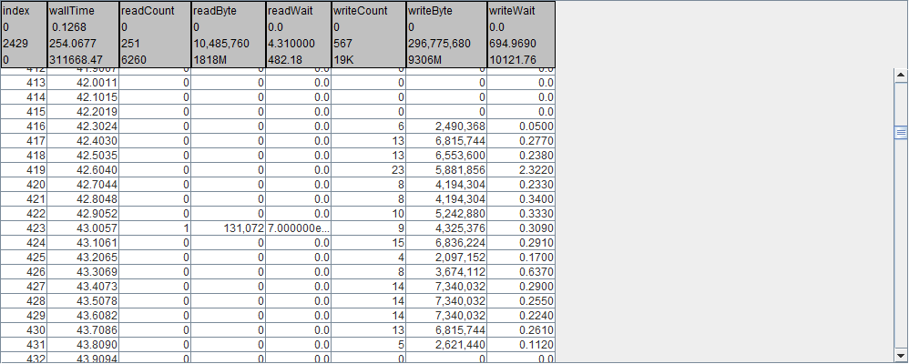

Disk statistics information instrumentation, as reported in  /proc/diskstats, can be enabled with a directive in an icf file:

```
​diskstats.interval={100}.devices={sd*}
```

The above requests the following diskstats related details be logged to the ilz file at an interval of 100 milliseconds. For each selected device, both a read table and a write table are generated.


Visualized in Pulse

