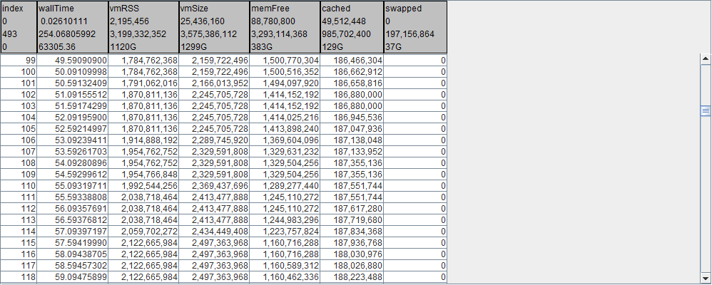
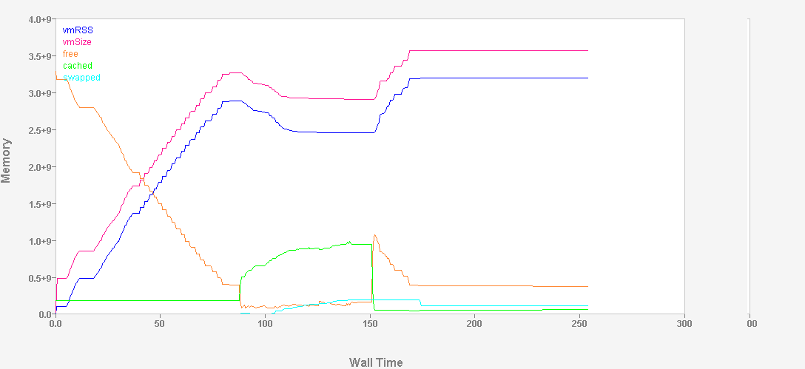

Memory information for a program being instrumented can be enabled with a directive in an icf file:
```​
meminfo.interval={500}
```
The above requests the following memory related details be logged to the ilz file at an interval of 500 milliseconds.


Visualized in Pulse

