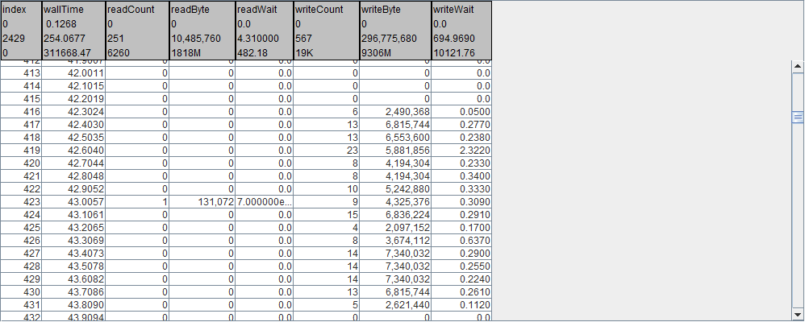
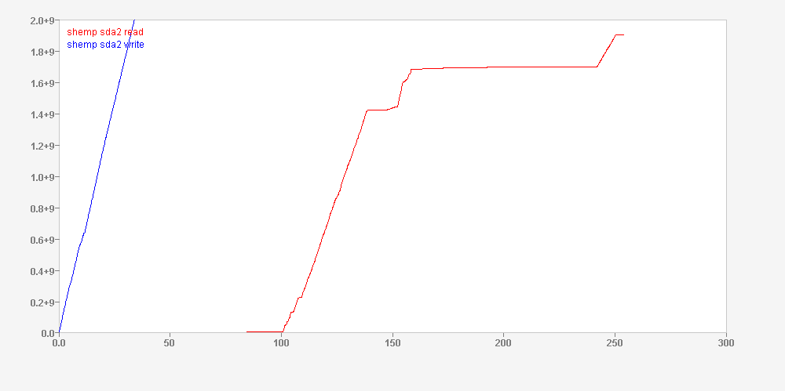

Disk statistics information instrumentation, as reported in  /proc/diskstats, can be enabled with a directive in an icf file:

```
​diskstats.interval={100}.devices={sd*}
```

This is a test of some sort.


Visualized in Pulse

